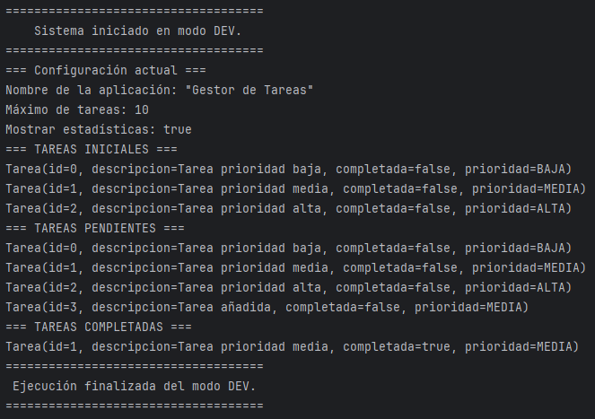
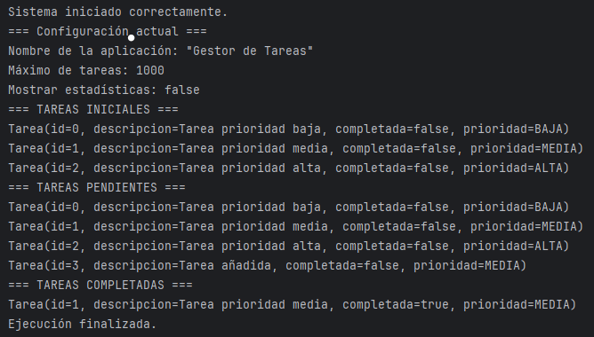

# Sistema de Gestión de Tareas - Spring Boot

## Descripción del Proyecto

Sistema de gestión de tareas (To-Do List) desarrollado con Spring Boot que demuestra la aplicación de conceptos fundamentales del framework:

- Inyección de dependencias por constructor
- Uso de estereotipos (@Service, @Repository, @Component)
- Configuración mediante application.properties
- Gestión de diferentes entornos con Spring Profiles
- Beans condicionales según el entorno
- CommandLineRunner para lógica de inicio

---

## Tecnologías Utilizadas

| Tecnología | Versión | Descripción |
|------------|---------|-------------|
| Java | 21      | Lenguaje de programación |
| Spring Boot | 3.5.7   | Framework principal |
| Maven | 3.9.11  | Gestión de dependencias |
| Spring DevTools | -       | Recarga automática durante desarrollo |
| Lombok | -       | Reducción de código boilerplate |

---

## Estructura del Proyecto

```
tareas/
├── src/
│   └── main/
│       ├── java/com/utn/tareas/
│       │   ├── model/
│       │   │   ├── Prioridad.java          # Enum de prioridades
│       │   │   └── Tarea.java              # Modelo de datos
│       │   ├── repository/
│       │   │   └── TareaRepository.java    # Capa de acceso a datos
│       │   ├── service/
│       │   │   ├── TareaService.java       # Lógica de negocio
│       │   │   ├── MensajeService.java     # Interfaz de mensajes
│       │   │   ├── MensajeDevService.java  # Implementación para desarrollo
│       │   │   └── MensajeProdService.java # Implementación para producción
│       │   └── TareasApplication.java      # Clase principal
│       └── resources/
│           ├── application.properties           # Configuración base
│           ├── application-dev.properties       # Configuración desarrollo
│           └── application-prod.properties      # Configuración producción
└── pom.xml                                 # Configuración Maven
```

---

## Instrucciones de Instalación y Ejecución

### Prerrequisitos

- Java JDK 21 o superior instalado
- Usar el wrapper incluido
- IDE recomendado: IntelliJ IDEA

### 1. Clonar el Repositorio

```bash
git clone github.com/LuisFerre1ra/FundamentosSpringboot
cd tareas
```

### 2. Compilar el Proyecto

```bash
mvn clean install
```

### 3. Ejecutar la Aplicación

**Opción A: Con Maven**
```bash
mvn spring-boot:run
```

**Opción B: Con Java (después de compilar)**
```bash
java -jar target/tareas-1.0.0.jar
```

**Opción C: Desde el IDE**
- Ejecutar la clase `TareasApplication.java` como aplicación Java

---

## 🔧 Cómo Cambiar entre Profiles (dev/prod)

Edita el archivo `src/main/resources/application.properties`:

```properties
# Para desarrollo
spring.profiles.active=dev

# Para producción
spring.profiles.active=prod
```
---

## Capturas de Pantalla

### Ejecución en Profile DEV



---

### Ejecución en Profile PROD



**Imagen pendiente**: Ejecutar con `spring.profiles.active=prod`

---

### Diferencias entre Profiles

| Característica | DEV | PROD |
|----------------|-----|------|
| Máximo de tareas | 10 | 1000 |
| Estadísticas | Habilitadas | Deshabilitadas |
| Nivel de logging | DEBUG | ERROR |
| Mensajes | Detallados y decorados | Simples y concisos |

---

## Funcionalidades Implementadas

### Modelo de Datos
- Enum `Prioridad` con niveles ALTA, MEDIA y BAJA
- Clase `Tarea` con id, descripción, estado de completitud y prioridad

### Repositorio (TareaRepository)
- Almacenamiento en memoria con `List<Tarea>`
- Generación automática de IDs con `AtomicLong`
- 5 tareas de ejemplo pre-cargadas
- Métodos CRUD básicos

### Servicio (TareaService)
- Agregar nueva tarea (con validación de límite)
- Listar todas las tareas
- Filtrar tareas pendientes
- Filtrar tareas completadas
- Marcar tarea como completada
- Generar estadísticas
- Mostrar configuración actual

### Profiles y Configuración
- Configuración mediante `application.properties`
- Inyección de valores con `@Value`
- Profiles para desarrollo y producción
- Beans condicionales con `@Profile`

### Interfaz de Usuario (Consola)
- CommandLineRunner para ejecución automática
- Mensajes diferenciados según el entorno
- Formato visual con iconos y colores

---

## Conceptos de Spring Boot Aplicados

### 1. Application Context e IoC
El contenedor de Spring gestiona automáticamente el ciclo de vida de todos los beans, eliminando la necesidad de crear instancias manualmente.

### 2. Inyección de Dependencias por Constructor
```java
public TareasApplication(TareaService tareaService, MensajeService mensajeService) {
    this.tareaService = tareaService;
    this.mensajeService = mensajeService;
}
```

### 3. Estereotipos
- `@Repository`: TareaRepository (capa de datos)
- `@Service`: TareaService, MensajeDevService, MensajeProdService (lógica de negocio)
- `@Component`: Para componentes genéricos (no usado en este proyecto)

### 4. Configuración Externa
```properties
app.nombre=Sistema de Gestión de Tareas
app.max-tareas=10
app.mostrar-estadisticas=true
```

### 5. Profiles
Permite configurar la aplicación para diferentes entornos sin cambiar el código:
```java
@Service
@Profile("dev")
public class MensajeDevService implements MensajeService { ... }
```

---

## Conclusiones Personales

Durante el desarrollo de este proyecto comprendí mejor cómo Spring Boot simplifica la configuración y el manejo de dependencias, permitiendo enfocarse en la lógica del negocio sin preocuparse por la infraestructura.
Aprendí la importancia de los profiles para adaptar una misma aplicación a distintos entornos (como desarrollo y producción) de forma limpia y escalable.
También reforcé conceptos fundamentales como la inyección de dependencias, el uso de estereotipos y la organización por capas, que resultan esenciales para construir aplicaciones mantenibles y profesionales.
En general, este trabajo me ayudó a consolidar una base sólida para futuros proyectos más complejos dentro del ecosistema Spring.

---

## Autor

**Nombre**: Luis Ferreira  
**Legajo**: 50896  
**Materia**: Desarrollo de Software  
**Trabajo Práctico**: Fundamentos de Spring Boot  
**Año**: 2024